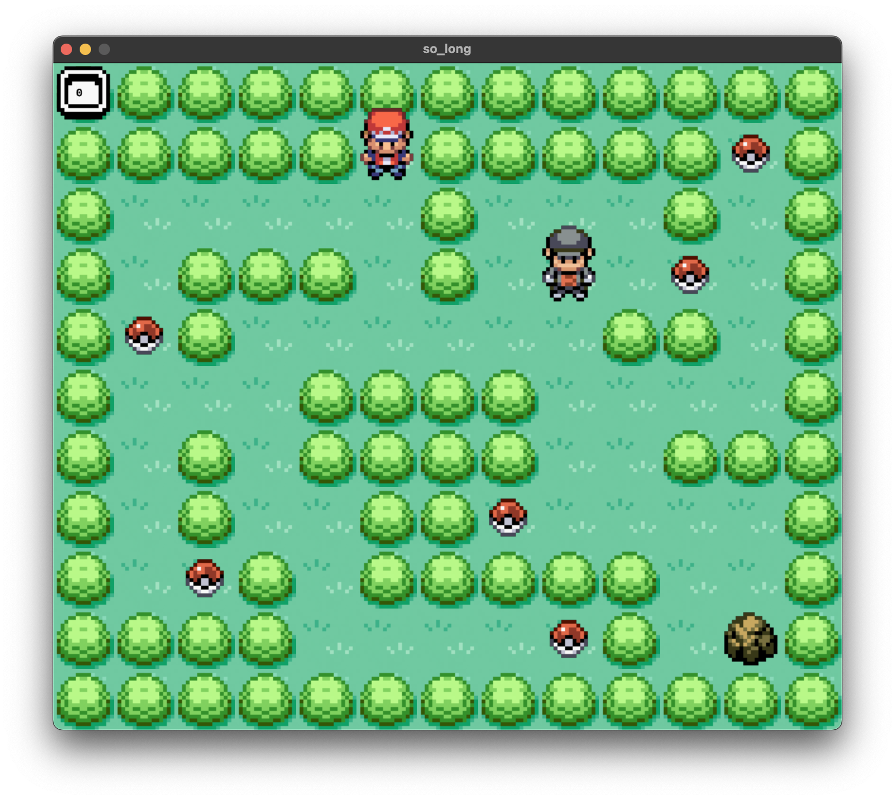

# so_long


This is a small game project from 42school implemented using MiniLibX. The project is inspired by Game Freak's Pokemon Firered.

## Goals
This project is a very small 2D game. It is built to make you work with textures, sprites. And some very basic gameplay elements.

## Getting Started

### Install
```bash
$ make bonus
$ ./so_long_bonus ./map/map_sl.ber
```

### HOW TO PLAY
The player’s goal is to collect all collectibles present on the map then escape with minimal movement.

 * `W`, `↑` : Move up.
 * `S`, `↓` : Move down.
 * `A`, `←` : Move left.
 * `D`, `→` : Move right.
 * `return ⏎` : Start game.
 * `R` : Retry.
 * `ESC ⎋` : Close the game window.

## Reference
 * [42Paris/minilibx-linux](https://github.com/42Paris/minilibx-linux)
 * [42Docs/minilibx](https://harm-smits.github.io/42docs/libs/minilibx)
 * [pret/Disassembly of Pokémon FireRed and LeafGreen](https://github.com/pret/pokefirered)
